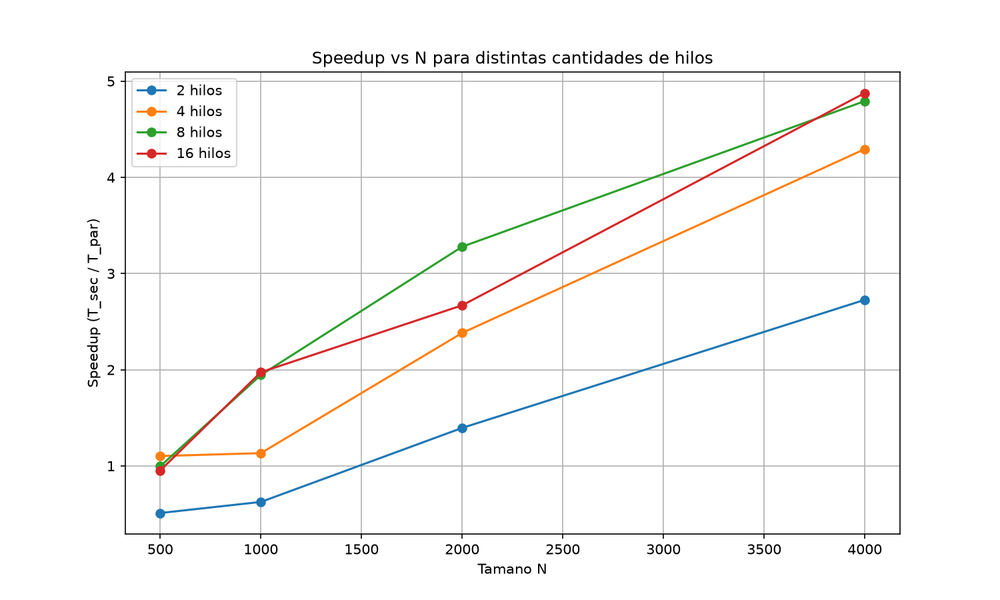

# Tercera entrega: paralelización con pthreads

## Resumen

En esta tercera entrega se extendió el programa de multiplicación de matrices para incorporar una versión concurrente/paralela implementada con **POSIX Threads (pthreads)** en C. La versión secuencial original — basada en el reloj monotónico `CLOCK_MONOTONIC` — se conserva como referencia y se somete a un experimento sistemático en el que se varía tanto el tamaño de la matriz (`N ∈ {500, 1000, 2000, 4000}`) como la cantidad de hilos (`T ∈ {2, 4, 8, 16}`). A partir de los tiempos medidos se calcula el *speedup* y se analiza experimentalmente el comportamiento del programa bajo paralelismo real.

---

## 1. Marco teórico

### 1.1 Concurrencia y paralelismo

Un **proceso** es una unidad de ejecución que posee, entre otros recursos, su propio espacio de direcciones. Un **hilo** (*thread*) es un flujo de ejecución que corre dentro de un proceso y comparte con los demás hilos del mismo proceso la memoria, los archivos abiertos y otros recursos del proceso; cada hilo tiene, en cambio, su propia pila y sus propios registros.

- **Concurrencia** se refiere a la propiedad de un programa de componerse de varias tareas que pueden progresar solapadas en el tiempo, sin implicar que avancen simultáneamente.
- **Paralelismo** se refiere a la ejecución **simultánea** de varias tareas sobre distintos núcleos del procesador.

Un programa concurrente implementado con pthreads puede aprovechar paralelismo real cuando se ejecuta en una máquina con varios núcleos; en una máquina de un solo núcleo, los hilos se intercalan y el programa es concurrente pero no paralelo.

### 1.2 POSIX Threads (pthreads)

`pthreads` es la API estándar POSIX para crear y manipular hilos en sistemas tipo Unix. Su cabecera es `<pthread.h>` y los programas que la usan deben enlazarse con la biblioteca pthread mediante el flag `-lpthread` en `gcc`. Las primitivas básicas utilizadas en este trabajo son:

| Función | Propósito |
|---|---|
| `pthread_create(&tid, NULL, fn, arg)` | crea un nuevo hilo que ejecuta `fn(arg)`; retorna inmediatamente |
| `pthread_join(tid, NULL)` | bloquea al hilo que llama hasta que `tid` termine |
| `pthread_t` | tipo opaco que identifica a un hilo creado |

### 1.3 Speedup y Ley de Amdahl

El *speedup* mide cuántas veces más rápida es la versión paralela respecto a la secuencial:

$$S_T = \frac{T_{\text{secuencial}}}{T_{\text{paralelo},\,T}}$$

donde $T$ es la cantidad de hilos. El *speedup* ideal es lineal: $S_T = T$. La **Ley de Amdahl** establece que el speedup está acotado por la fracción secuencial no paralelizable del programa:

$$S_T \le \frac{1}{f_s + \dfrac{1-f_s}{T}}$$

donde $f_s$ es la fracción del trabajo que no puede paralelizarse (creación de hilos, sincronización, partes del algoritmo intrínsecamente secuenciales). En la práctica, además, aparecen otros factores que degradan el speedup: contención por ancho de banda de memoria, fallos de caché y sobrecarga de planificación del sistema operativo.

---

## 2. Diseño de la implementación

### 2.1 Estrategia de partición del trabajo

El programa paralelo reutiliza exactamente el mismo bucle triple anidado de la versión secuencial:

```c
for (int i = 0; i < N; i++)
  for (int j = 0; j < N; j++)
    for (int k = 0; k < N; k++)
      C[i*N + j] += A[i*N + k] * B[k*N + j];
```

La paralelización se hace **repartiendo filas de la matriz resultado `C`** entre los `T` hilos. Si $N$ es divisible por $T$, cada hilo recibe exactamente $N/T$ filas; si no lo es, los primeros $N \bmod T$ hilos reciben una fila extra para equilibrar la carga. Por ejemplo, con $N = 1000$ y $T = 4$ la partición es:

| Hilo | Filas asignadas (inclusivo, exclusivo) | Cantidad |
|---|---|---|
| 0 | [0, 250) | 250 |
| 1 | [250, 500) | 250 |
| 2 | [500, 750) | 250 |
| 3 | [750, 1000) | 250 |

### 2.2 Por qué no hace falta sincronización

Cada hilo escribe exclusivamente en su propio rango de filas de `C`, por lo que **no hay condición de carrera sobre `C`**. Los hilos leen simultáneamente las matrices `A` y `B`; la lectura concurrente sin escritura es segura y no requiere exclusión mutua. En consecuencia, el programa no utiliza mutex, barreras ni variables de condición; la única sincronización necesaria es el `pthread_join` final, que garantiza que el hilo principal espere a que todos los hilos terminen antes de continuar.

### 2.3 Medición del tiempo

Se reutiliza la misma metodología de la entrega anterior: `clock_gettime(CLOCK_MONOTONIC, ...)` con `struct timespec`. El intervalo medido en la versión paralela abarca explícitamente la creación de los hilos, el trabajo paralelo y el `pthread_join` — es decir, **se mide el tiempo que tarda el usuario en obtener el resultado paralelo**, lo que incluye el *overhead* real de utilizar múltiples hilos. Esto es coherente con la versión secuencial, que mide únicamente el trabajo de multiplicación.

### 2.4 Algoritmo empleado por cada hilo

La función `worker(args)` que ejecuta cada hilo es, literalmente, el triple bucle anidado original, sustituyendo `0` por `args->inicio` y `N` por `args->fin` en el bucle externo:

```c
static void *worker(void *arg) {
    ArgsHilo *a = (ArgsHilo *)arg;
    for (int i = a->inicio; i < a->fin; i++)
        for (int j = 0; j < a->N; j++)
            for (int k = 0; k < a->N; k++)
                a->C[i*a->N + j] +=
                    a->A[i*a->N + k] *
                    a->B[k*a->N + j];
    return NULL;
}
```

Manteniendo el mismo cuerpo algorítmico se garantiza que las diferencias observadas entre la versión secuencial y la paralela se deban exclusivamente al particionamiento y a los hilos, y no a optimizaciones adicionales.

---

## 3. Estructura del proyecto

```
mult_matriz/
├── Makefile
├── README.md
├── .gitignore
├── src/                   # archivos .c con los main() de cada versión
│   ├── matriz_monotonic.c # versión secuencial (referencia)
│   └── matriz_pthreads.c  # versión paralela con pthreads
├── include/               # cabeceras públicas de los módulos
│   ├── memoria.h          # reserva de matrices (compartida)
│   ├── llenado.h          # inicialización aleatoria (compartida)
│   ├── tiempo_mult.h      # tiempo + multiplicación secuencial
│   └── pthread_mult.h     # tiempo + multiplicación paralela
├── modules/               # implementaciones (.c) de los módulos
│   ├── memoria.c
│   ├── llenado.c
│   ├── tiempo_mult.c
│   └── pthread_mult.c
├── experiments/
│   ├── run.sh             # automatiza las 20 mediciones
│   ├── plot.py            # genera la gráfica de speedup
│   ├── resultados.csv     # datos crudos (versionado)
│   └── speedup.png        # gráfica generada (versionada)
└── bin/                   # binarios compilados (generados, no versionados)
```

### 3.1 Tipos de archivo

- **`.c`**: implementación. Contiene el código que efectivamente realiza el trabajo.
- **`.h`**: cabecera. Contiene las **declaraciones** de funciones, tipos y constantes que otros archivos pueden usar. Es el "contrato público" del módulo.
- **`Makefile`**: script que define las reglas de compilación.
- **`.gitignore`**: lista de archivos y carpetas que el repositorio ignora (binarios, datos generados, gráficas).

### 3.2 Modularización

Ambas versiones comparten los módulos `memoria` y `llenado`, lo que evita duplicación:

- **`memoria`** (`modules/memoria.c`, `include/memoria.h`): calcula `N*N`, reserva memoria para las tres matrices con `malloc` y verifica que las reservas se realizaron correctamente. Devuelve una struct `Matrices` con los tres punteros y el total de elementos.
- **`llenado`** (`modules/llenado.c`, `include/llenado.h`): inicializa la semilla del generador de números aleatorios (`srand(time(NULL))`) y llena `A` y `B` con valores aleatorios en `[1, valor_maximo]`, además de poner `C` en cero.
- **`tiempo_mult`** (`modules/tiempo_mult.c`, `include/tiempo_mult.h`): mide y ejecuta la multiplicación secuencial.
- **`pthread_mult`** (`modules/pthread_mult.c`, `include/pthread_mult.h`): mide y ejecuta la multiplicación paralela con pthreads.

---

## 4. Compilación y ejecución

Toda la gestión del proyecto se realiza desde la raíz del repositorio mediante `make`.

| Comando | Efecto |
|---|---|
| `make` o `make all` | Compila ambas versiones; deja los binarios en `bin/`. |
| `make run <N> <valor_maximo>` | Compila (si hace falta) y ejecuta la versión **secuencial**. |
| `make run_par <N> <valor_maximo> <num_hilos>` | Compila (si hace falta) y ejecuta la versión **paralela**. |
| `make clean` | Elimina los binarios generados. |

Ejemplos puntuales:

```bash
make clean
make run 500 10           # secuencial
make run_par 500 10 4     # paralelo con 4 hilos
```

`make run_par` enlaza con `-lpthread` automáticamente gracias a la regla correspondiente del Makefile.

---

## 5. Diseño experimental

### 5.1 Hardware y entorno

Las mediciones se realizaron sobre un equipo con las siguientes características:

- **CPU**: Intel Core i5-12450HX (12.ª generación).
- **Núcleos lógicos disponibles**: 12 (8 núcleos físicos con *hyperthreading* activo).
- **Sistema operativo**: Linux.
- **Compilador**: `gcc` con flags `-Wall -Wextra -O2`.

### 5.2 Variables y métricas

- **Variable independiente 1 — tamaño de la matriz `N`**: 500, 1000, 2000 y 4000.
- **Variable independiente 2 — número de hilos `T`**: 1 (secuencial), 2, 4, 8 y 16.
- **Variable dependiente — tiempo de ejecución**: medido en segundos con `clock_gettime(CLOCK_MONOTONIC)`.
- **Métrica derivada — speedup**: $S_T = T_{\text{sec}} / T_{\text{par}}$.

Se realizaron **20 mediciones en total**: 4 tamaños × 5 configuraciones (1, 2, 4, 8 y 16 hilos). Cada corrida utilizó matrices `A` y `B` con valores aleatorios en el rango $[1, 10]$ generadas con `srand`/`rand`.

### 5.3 Automatización

Para asegurar que todas las mediciones siguieran exactamente el mismo procedimiento, se creó el script `experiments/run.sh`, que itera sobre los cuatro tamaños y, para cada uno, ejecuta la versión secuencial y la paralela con 2, 4, 8 y 16 hilos, almacenando los tiempos en `experiments/resultados.csv`.

La gráfica de speedup se genera con `experiments/plot.py`, que lee el CSV y produce `experiments/speedup.png` utilizando `matplotlib`.

---

## 6. Resultados

### 6.1 Tiempos de ejecución medidos (segundos)

| N   | 1 hilo (sec) | 2 hilos       | 4 hilos       | 8 hilos       | 16 hilos      |
| --- | ------------ | ------------- | ------------- | ------------- | ------------- |
| 500   | 0.060872 | 0.119230 | 0.055199 | 0.061106 | 0.063904 |
| 1000  | 0.585744 | 0.936437 | 0.517075 | 0.301106 | 0.296705 |
| 2000  | 11.17299 | 8.008481 | 4.689642 | 3.407542 | 4.185647 |
| 4000  | 257.5998 | 94.47988 | 59.99602 | 53.75035 | 52.82112 |

### 6.2 Speedup observado ($S_T = T_{\text{sec}} / T_{\text{par}}$)

| N   | 2 hilos | 4 hilos | 8 hilos | 16 hilos |
| --- | ------- | ------- | ------- | -------- |
| 500   | 0.51 | 1.10 | 1.00 | 0.95 |
| 1000  | 0.63 | 1.13 | 1.95 | 1.97 |
| 2000  | 1.39 | 2.38 | 3.28 | 2.67 |
| 4000  | 2.73 | 4.29 | 4.79 | 4.88 |

### 6.3 Gráfica de speedup

La curva de speedup en función de `N` para cada cantidad de hilos, generada a partir del CSV anterior, es la siguiente:



El eje X corresponde al tamaño de la matriz `N` (500, 1000, 2000, 4000) y el eje Y al speedup `T_sec / T_par`. Cada curva representa una cantidad fija de hilos.

### 6.4 Resultados detallados por tamaño

Para complementar las tablas, a continuación se resumen los valores extremos y el mejor speedup alcanzado para cada `N`:

| N    | Tiempo secuencial | Mejor tiempo paralelo | Hilos en mejor caso | Speedup máximo |
| ---: | ----------------: | -------------------: | ------------------: | -------------: |
| 500    | 0.060872 s | 0.055199 s |  4 | 1.10× |
| 1000   | 0.585744 s | 0.296705 s | 16 | 1.97× |
| 2000   | 11.17299 s | 3.407542 s |  8 | 3.28× |
| 4000   | 257.5998 s | 52.82112 s | 16 | 4.88× |

Se observa que:

- Con `N = 500` y `N = 1000`, el *overhead* de crear y sincronizar hilos reduce o anula el beneficio del paralelismo. El mejor caso apenas supera a la versión secuencial.
- Con `N = 2000` y `N = 4000`, el speedup crece monótonamente con la cantidad de hilos hasta estabilizarse en torno a 4.8, valor que coincide con la capacidad efectiva de cómputo paralelo de la máquina (12 núcleos lógicos, de los cuales alrededor de 5–6 participan eficientemente en este problema limitado por memoria).

El CSV completo con las 20 mediciones queda almacenado en `experiments/resultados.csv`:

```csv
N,threads,tiempo
500,1,0.060872128
500,2,0.119229636
500,4,0.055198751
500,8,0.061105585
500,16,0.063904262
1000,1,0.585743579
1000,2,0.936436967
1000,4,0.517074596
1000,8,0.301106325
1000,16,0.296704704
2000,1,11.172985833
2000,2,8.008480854
2000,4,4.689642145
2000,8,3.407541602
2000,16,4.185647044
4000,1,257.599817138
4000,2,94.479881127
4000,4,59.996019865
4000,8,53.750351709
4000,16,52.821123640
```

---

## 7. Análisis de resultados

### 7.1 El speedup depende fuertemente del tamaño del problema

El primer hallazgo es que **no existe un valor único de speedup**: el mismo programa con la misma cantidad de hilos obtiene speedups muy distintos según `N`. Para `T = 16` pasamos de un speedup de 0.95 (con `N = 500`) a uno de 4.88 (con `N = 4000`). La explicación es la relación entre **trabajo computacional** y **overhead de paralelización**:

- El *overhead* incluye: llamada a `pthread_create`, planificación de los hilos en el sistema operativo, accesos contenciosos a memoria y `pthread_join`. Este *overhead* es aproximadamente constante o crece muy poco con `N`.
- El trabajo útil escala como $O(N^3)$. A medida que `N` crece, la fracción del tiempo total debida al *overhead* se vuelve cada vez más pequeña y el paralelismo puede expresarse.

### 7.2 Para problemas pequeños, paralelizar puede ser contraproducente

Con `N = 500`, dos hilos tardan **más** que la versión secuencial (0.119 s vs 0.061 s). El *overhead* de crear y destruir dos hilos resulta mayor que el trabajo total a repartir. Esta observación coincide con la predicción de Amdahl: existe un tamaño mínimo de problema por debajo del cual el paralelismo no aporta beneficio.

### 7.3 El speedup se aleja del ideal lineal y satura

La máquina ofrece 12 núcleos lógicos, por lo que el speedup teórico ideal con `T = 16` sería 16 (o, en el mejor caso, cercano a 12 si todos los hilos se ejecutan realmente en paralelo). El speedup observado en `N = 4000` es **4.88**, muy por debajo. Esto es consecuencia de varios factores acumulativos:

1. **Sobrecarga de creación y sincronización de hilos**, ya mencionada.
2. **Ancho de banda de memoria compartido**: todos los hilos leen las matrices `A` y `B` completas y escriben en `C`. Cuando `N` crece, estas matrices dejan de caber en la caché L2 del procesador y los hilos compiten por el ancho de banda de la memoria principal, que se vuelve el cuello de botella.
3. **Fracción secuencial real**: la reserva de memoria, el llenado y la toma de tiempos no se paralelizan. Cualquier porción no paralelizable fija un techo al speedup posible.

### 7.4 Meseta entre 8 y 16 hilos

A partir de `T = 8`, añadir más hilos produce una mejora marginal: con `N = 4000`, el speedup pasa de 4.79 (8 hilos) a 4.88 (16 hilos), apenas un 2 % de mejora. Los 8 hilos ya saturan la capacidad de cómputo y de memoria útil de la máquina; los 8 hilos adicionales compiten por los mismos recursos sin aportar trabajo neto. Este fenómeno es característico del comportamiento predicho por la Ley de Amdahl cuando la fracción paralelizable se acerca a la unidad pero el *overhead* crece con `T`.

### 7.5 Comparación del mejor caso con la Ley de Amdahl

Si en el mejor caso (`N = 4000`, 16 hilos) se asume un speedup observado de 4.88, puede estimarse la fracción secuencial $f_s$ implícita. Para una Ley de Amdahl "estricta":

$$4.88 \approx \frac{1}{f_s + (1-f_s)/16} \implies f_s \approx 0{,}002$$

Es decir, la porción teóricamente paralelizable explicaría un speedup mucho mayor; el valor real es menor por factores no modelados por la ley (memoria, contención, planificación del SO). Esta diferencia entre la cota de Amdahl y la medición real es esperada e ilustra que la ley es un **techo**, no una predicción exacta.

---

## 8. Conclusiones

1. La paralelización con pthreads de la multiplicación de matrices es **técnicamente viable** y permite obtener speedups cercanos a 5× con 16 hilos en máquinas con 12 núcleos lógicos.
2. El beneficio del paralelismo **depende críticamente del tamaño del problema**: para matrices pequeñas (`N = 500`), el *overhead* supera al trabajo y el speedup puede ser inferior a 1.
3. El speedup real está acotado por **factores no algorítmicos** como el ancho de banda de memoria y la competencia por caché, que no aparecen en el modelo ideal de Amdahl.
4. Existe un **punto de saturación** a partir del cual añadir más hilos no aporta beneficio adicional; identificarlo es importante para dimensionar correctamente los recursos en HPC.
5. La modularización previa (entrega anterior) facilitó la incorporación de la versión paralela: los módulos `memoria` y `llenado` se reutilizaron tal cual, y solo fue necesario añadir el módulo `pthread_mult` y un nuevo `main` (`matriz_pthreads.c`).

---

## 9. Cómo reproducir el experimento

```bash
# desde la raíz del proyecto
make clean
make all

# corrida individual para verificar
make run 500 10
make run_par 500 10 4

# experimento completo (20 mediciones)
bash experiments/run.sh

# gráfica de speedup (requiere matplotlib)
python3 experiments/plot.py

# resultados
cat experiments/resultados.csv
xdg-open experiments/speedup.png   # o el visor preferido
```

El CSV queda en `experiments/resultados.csv` y la gráfica en `experiments/speedup.png`; ambos forman parte del repositorio y representan los resultados del experimento. Si se vuelve a correr la experimentación con `bash experiments/run.sh`, los valores se regeneran en el mismo formato y pueden reemplazarse con un commit posterior.
