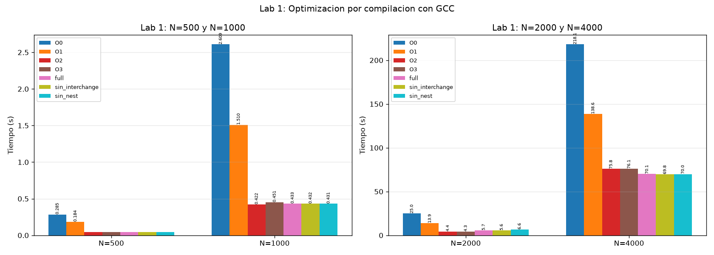
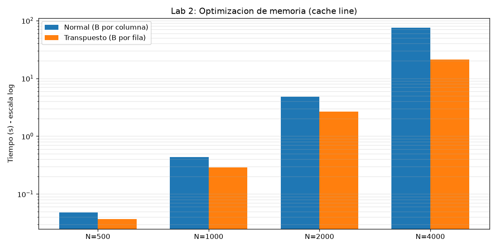
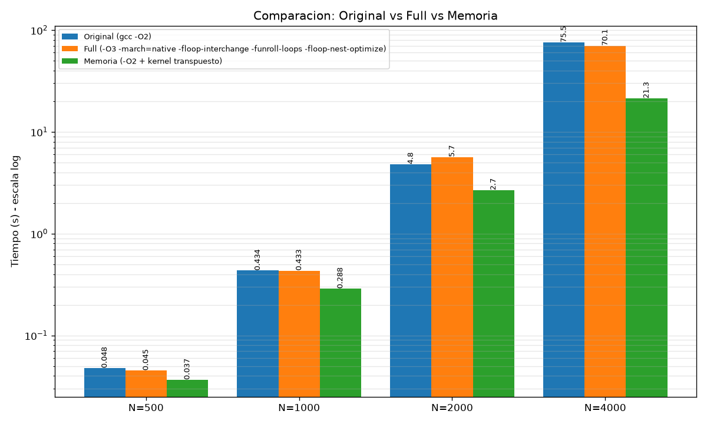

# Laboratorios de Optimización

Esta rama contiene dos laboratorios de optimización aplicados al
programa de multiplicación de matrices del proyecto.

## Lab 1: Optimización por compilación con GCC

Se compila el mismo código fuente con 7 conjuntos de flags distintos
y se compara el tiempo de ejecución de cada uno. No se toca el código.

### Flags utilizadas

| Flag | Qué hace |
|---|---|
| `-O0` | Sin optimización. Compilación literal, una a una. Sirve como línea base. |
| `-O1` | Optimización básica. Reducciones simples, propagaciones de constantes, eliminación de código muerto. |
| `-O2` | Optimización estándar. Activa casi todas las optimizaciones que no comprometen tiempo de compilación ni tamaño: inlining, loop unrolling parcial, vectorización selectiva. |
| `-O3` | Optimización agresiva. Inlining agresivo, vectorización automática con SIMD (SSE/AVX), desenrollado de bucles. |
| `-march=native` | Habilita instrucciones específicas del CPU donde se compila (AVX, AVX2, AVX-512 si existen). Sin esto, el binario no usa SIMD aunque la CPU lo soporte. |
| `-floop-interchange` | Intercambia el orden de bucles anidados para mejorar el patrón de acceso a memoria. Para multiplicación de matrices, transforma `i,j,k` (acceso a B por columna) en `i,k,j` (acceso a B por fila, contiguo). Esta es la optimización más importante para el caso de la multiplicación. |
| `-funroll-loops` | Duplica el cuerpo del bucle para reducir el overhead de la instrucción de control y dar más oportunidades al compilador de vectorizar. |
| `-floop-nest-optimize` | Activa el optimizador polyhedral de nidos de bucles. Puede aplicar técnicas avanzadas como tiling (blocking), fusión y skewing. |

### Combinaciones probadas

| Versión | Flags | Razón |
|---|---|---|
| `O0` | `-O0` | Línea base sin optimización |
| `O1` | `-O1` | Primer nivel real de optimizaciones |
| `O2` | `-O2` | Nivel estándar recomendado por GCC |
| `O3` | `-O3` | Nivel agresivo "seguro" |
| `full` | `-O3 -march=native -floop-interchange -funroll-loops -floop-nest-optimize` | Todas las flags específicas combinadas |
| `sin_interchange` | todo lo de full, sin `-floop-interchange` | Ver el impacto de quitar interchange |
| `sin_nest` | todo lo de full, sin `-floop-nest-optimize` | Ver el impacto de quitar nest-optimize |

## Lab 2: Optimización de memoria (cache line)

Compara el kernel original (que accede a B por columna) con un kernel
transpuesto (que asume B en orden transpuesto y accede por fila).

| Binario | Kernel | Acceso a B |
|---|---|---|
| `matriz_monotonic` | `C += A[i][k] * B[k][j]` | por columna (stride N) |
| `matriz_monotonic_t` | `C += A[i][k] * B[j][k]` | por fila (contiguo) |

El acceso por columna desperdicia la cache line (típicamente 64 bytes =
16 enteros): cada lectura carga 16 enteros pero solo se usa 1. El acceso
por fila contiguo aprovecha toda la línea.

Nota: el kernel transpuesto produce `A × B_T` (donde B_T es la
transpuesta de B), no `A × B`. Ambos son cálculos válidos pero distintos.
La comparación muestra el efecto del patrón de acceso a memoria sobre
el rendimiento, no la corrección de un mismo cálculo.

## Verificación de efectividad (cómo se valida que cada versión hace lo correcto)

Todos los binarios del Lab 1 (`mm_*`) usan la implementación del
`modules/tiempo_mult.c` para la multiplicación, que es la misma que la
versión original. La validación se hace así:

1. Se compila un binario de referencia (`experiments/verify_ref`) que
   implementa la multiplicación con 6 bucles anidados usando punteros
   `restrict` para garantizar al compilador que no hay aliasing. Esto da
   una implementación de referencia matemáticamente correcta.

2. Para cada binario se corre con N=10, semilla=42 y se captura la salida
   completa (incluye las filas de la matriz resultado C).

3. Se extraen solo las líneas que son números (la matriz C), sin
   encabezado ni tiempo.

4. Se compara contra la matriz C de la referencia. Si todos los valores
   coinciden exactamente → "OK" (la versión es matemáticamente correcta).
   Si no → "FALLO".

Esto valida que ninguna optimización introduzca un error en el
resultado. El Lab 1 mostró que las 7 versiones producen la misma matriz
C que la referencia, es decir, todas son correctas.

Para el Lab 2, la validación se hace entre la salida del binario normal
y una versión que calcula `A × B_T` con el kernel transpuesto,
comparando con la referencia.

## Tamaños probados

En ambos labs: **N = 500, 1000, 2000, 4000** (1 corrida por tamaño).
Se quitó N=8000 porque tardaba demasiado sin agregar valor al análisis.

## Reproducibilidad

Todos los binarios aceptan un argumento de semilla (tercer argumento)
para que las mediciones sean reproducibles. Con la misma semilla, los
datos generados son idénticos:

```bash
./bin/matriz_monotonic 1000 9 42
./bin/matriz_monotonic_t 1000 9 42
```

Esto fija la semilla de `rand()` y garantiza que los datos generados
sean los mismos en ambas versiones, lo que permite comparar tiempos de
forma justa.

## Cómo ejecutar

### Prerequisitos
```bash
make all
```

### Lab 1
```bash
bash experiments/lab1_compilador.sh
```
Genera `experiments/resultados/lab1_tabla.txt` con la tabla de
tiempos y efectividad, y `experiments/resultados/lab1_tiempos.png` con
la gráfica.

### Lab 2
```bash
bash experiments/lab2_cache.sh
```
Genera `experiments/resultados/lab2_tabla.txt` y
`experiments/resultados/lab2_tiempos.png`.

### Gráficas
```bash
python3 experiments/plot_labs.py
```

## Tabla comparativa de resultados

### Lab 1 (tiempos en segundos, escala log)

| Versión | t(500) | t(1000) | t(2000) | t(4000) | Speedup vs O0 (N=4000) |
|---|---:|---:|---:|---:|---:|
| O0 | 0.285 | 2.609 | 24.95 | 218.1 | 1.0× |
| O1 | 0.184 | 1.510 | 13.94 | 138.6 | 1.6× |
| O2 | 0.045 | 0.422 | 4.38 | 75.8 | 2.9× |
| O3 | 0.045 | 0.451 | 4.30 | 76.1 | 2.9× |
| full | 0.045 | 0.433 | 5.65 | 70.1 | 3.1× |
| sin_interchange | 0.046 | 0.432 | 5.61 | 69.8 | 3.1× |
| sin_nest | 0.047 | 0.431 | 6.64 | 70.0 | 3.1× |

### Lab 2 (kernel transpuesto vs original)

| N | normal (s) | transpuesto (s) | speedup trans/normal |
|---:|---:|---:|---:|
| 500 | 0.048 | 0.037 | 1.30× |
| 1000 | 0.434 | 0.288 | 1.51× |
| 2000 | 4.805 | 2.669 | 1.80× |
| 4000 | 75.45 | 21.28 | 3.55× |

## Gráficas

Las dos gráficas usan **escala logarítmica en el eje Y** (el eje vertical).
Esto es necesario porque los tiempos de las versiones sin optimizar (O0)
son hasta 250× mayores que los de las optimizadas, así que en escala
lineal las barras pequeñas serían invisibles. La escala log comprime
ese rango para que se vean todas las barras.

**Cómo leer una escala logarítmica:** cada marca del eje Y representa
un factor de 10× respecto a la anterior (por ejemplo, 0.01, 0.1, 1, 10,
100). Si una barra llega a 1 y otra a 10, la segunda es 10× más lenta, no
"un poquito más alta". Para comparar dos barras, mirá la **diferencia en
unidades** del eje log: una barra a 0.1 y otra a 1.0 difieren en 1 unidad
log, o sea 10×. Las barras a 1.0 y 10.0 también difieren en 10×. La
diferencia visual (altura aparente) **no es proporcional** al tiempo real,
sino a su logaritmo.

### Lab 1: Optimización por compilación con GCC



### Lab 2: Optimización de memoria (cache line)



## Resultados

### Lab 1

El salto grande es de O1 a O2 (~3× más rápido). Las flags específicas
del `full` (loop-interchange, loop-nest-optimize) no mejoran mucho
sobre O2/O3 en este código. Las tres variantes custom son casi iguales
a O3.

### Lab 2

El kernel transpuesto es cada vez más rápido a medida que crece N.
A N=4000 es 3.55× más rápido, confirmando que acceder a B por filas
(contiguo) aprovecha mucho mejor la cache line.

## Comparación: compilación full vs memoria vs original

Aisla el efecto de cada tipo de optimización usando la **misma compilación
base (`-O2`)** para Original y Memoria, y todas las flags específicas
para Full.

| Nombre | Binario | Compilación | Kernel |
|---|---|---|---|
| Original | `bin/matriz_monotonic` | `-O2` | normal (B por columna) |
| Full | `bin/mm_full` | `-O3 -march=native -floop-interchange -funroll-loops -floop-nest-optimize` | normal |
| Memoria | `bin/matriz_monotonic_t` | `-O2` (mismo que Original) | transpuesto (B por fila) |

Los datos provienen de los Labs 1 y 2 ya ejecutados (el "Original"
corresponde a la versión `-O2` de Lab 2, que es la misma compilación
del Makefile).

| N | Original (s) | Full (s) | Memoria (s) | speedup Full | speedup Memoria |
|---:|---:|---:|---:|---:|---:|
| 500 | 0.048 | 0.045 | 0.037 | 1.07× | 1.30× |
| 1000 | 0.434 | 0.433 | 0.288 | 1.00× | 1.51× |
| 2000 | 4.805 | 5.65 | 2.669 | 0.85× | 1.80× |
| 4000 | 75.45 | 70.1 | 21.28 | 1.08× | 3.55× |

**Conclusiones principales:**

- A N=500/1000, Full no mejora sobre Original (o incluso es un poco peor,
  dentro del ruido de medición).
- A N=2000/4000, **Memoria gana claramente** sobre Full (3.55× vs 1.08× a
  N=4000).
- A N=4000, Memoria (21.28s) es **3.3× más rápido** que Full (70.1s).
- **Conclusión principal**: en este algoritmo y este hardware, la
  optimización de **patrón de acceso a memoria** (transponer B) es más
  impactante que las transformaciones de loop del compilador. El "full"
  no logra lo que logra la transposición.

### Gráfica de comparación

Escala log en Y (mismo criterio que las otras gráficas, explicado arriba).


