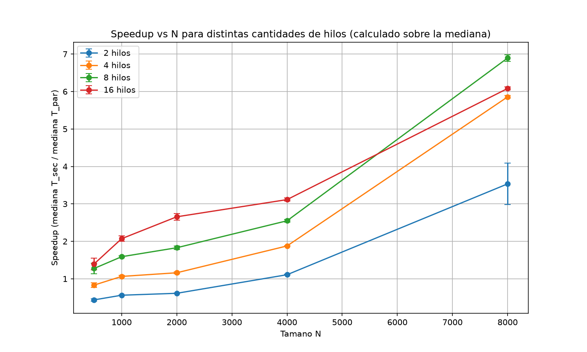
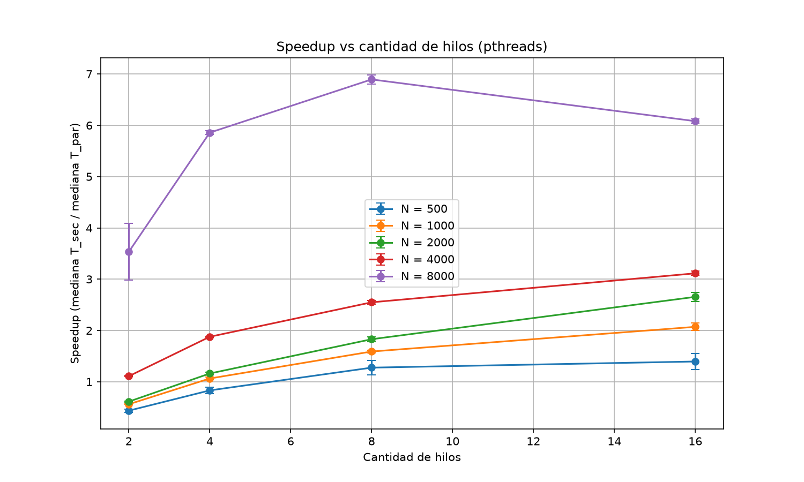

# Tercera entrega: paralelización con pthreads

## Resumen

En esta tercera entrega se extendió el programa de multiplicación de matrices para incorporar una versión paralela usando **POSIX Threads (pthreads)** en C. La versión secuencial original se conserva como referencia.

Se hizo un experimento donde se variaron dos cosas:

- El **tamaño de la matriz**: `N ∈ {500, 1000, 2000, 4000, 8000}`
- La **cantidad de hilos**: `T ∈ {1, 2, 4, 8, 16}` (T=1 es la versión secuencial)

Cada combinación se ejecutó **10 veces** y se calcularon media, mediana y desviación estándar. Con la mediana se calculó el *speedup*.

---

## 1. Conceptos clave

### 1.1 Wall clock vs tiempo de CPU

El comando Unix `time programa` desglosa el tiempo consumido en:

- **Wall clock** (tiempo total transcurrido): tiempo real desde que arranca hasta que termina. Es lo que el usuario percibe como "cuánto tardó".
- **Tiempo de CPU**: lo que la CPU pasó realmente ejecutando nuestro programa. Se subdivide en tiempo de usuario y tiempo de sistema (atendiendo llamadas al kernel).

El profesor dijo que **la métrica correcta para medir rendimiento es el wall clock**, porque refleja lo que el usuario percibe.

En este proyecto usamos `clock_gettime(CLOCK_MONOTONIC_RAW)` para medir wall clock. Esta función devuelve el tiempo real transcurrido sin verse afectada por correcciones automáticas del reloj del sistema (NTP), por eso es la más precisa para mediciones.

**Importante**: solo se mide el tiempo de la multiplicación, no se cuenta el tiempo de reservar memoria, generar matrices aleatorias, ni imprimir resultados.

### 1.2 Speedup

El speedup mide cuántas veces más rápida es la versión paralela respecto a la secuencial:

```
S = T_secuencial / T_paralelo
```

El speedup ideal con `T` hilos sería `T` (lineal). En la práctica es menor por el *overhead* de crear hilos, contención de memoria, etc.

### 1.3 Diez corridas por configuración

El profesor insistió en repetir el experimento varias veces porque una sola medición puede estar contaminada por ruido del sistema operativo (quantum preemptions, otros procesos usando CPU).

Con 10 corridas calculamos:

- **Media aritmética**: promedio de las 10 mediciones.
- **Mediana**: el valor central al ordenar las 10 mediciones. Es **robusta a valores atípicos** (outliers).
- **Desviación estándar (σ)**: qué tanto se dispersan las mediciones.

Usamos la **mediana** como medida principal del speedup para que un outlier no distorsione el resultado.

### 1.4 Orden de los bucles

El script recorre `for run_id in {1..10}: for n in tamanos: ...`. Es decir, para cada repetición pasa por **todos los tamaños** antes de la siguiente repetición.

El profesor explicó que si invirtiéramos el orden y corrieramos las 10 repeticiones de N=500 seguidas, los datos quedarían guardados en las memorias rápidas del procesador (caché) y el sistema no se molestaría en traerlos desde la memoria RAM. La medición saldría artificialmente rápida. Al intercalar tamaños entre repeticiones, cada medición se ve forzada a traer datos nuevos desde RAM, dando resultados más realistas.

---

## 2. El código

### 2.1 Estrategia de partición

El programa paralelo reutiliza el mismo bucle triple anidado del secuencial, pero reparte las **filas de la matriz resultado C** entre los T hilos:

```c
for (int i = 0; i < N; i++)
  for (int j = 0; j < N; j++)
    for (int k = 0; k < N; k++)
      C[i*N + j] += A[i*N + k] * B[k*N + j];
```

Si N es divisible por T, cada hilo recibe N/T filas; si no, los primeros hilos reciben una fila extra para equilibrar la carga. Ejemplo con N=1000 y T=4:

| Hilo | Filas asignadas |
|---|---|
| 0 | [0, 250) |
| 1 | [250, 500) |
| 2 | [500, 750) |
| 3 | [750, 1000) |

### 2.2 Por qué no hace falta sincronización

Cada hilo escribe **exclusivamente en su propio rango de filas de C**, así que no hay condición de carrera. Los hilos leen A y B simultáneamente (lectura sin escritura es segura).

La única sincronización necesaria es el `pthread_join` al final, para que el programa principal espere a que todos los hilos terminen antes de continuar.

---

## 3. Estructura del proyecto

```
mult_matriz/
├── Makefile
├── README.md
├── .gitignore
├── src/                # archivos .c con los main() de cada versión
│   ├── matriz_monotonic.c   # versión secuencial
│   └── matriz_pthreads.c    # versión paralela
├── include/            # cabeceras (.h) de los módulos
│   ├── memoria.h       # reserva de memoria
│   ├── llenado.h       # llenado aleatorio
│   ├── tiempo_mult.h   # multiplicación secuencial + tiempo
│   └── pthread_mult.h  # multiplicación paralela + tiempo
├── modules/            # implementaciones (.c) de los módulos
│   ├── memoria.c
│   ├── llenado.c
│   ├── tiempo_mult.c
│   └── pthread_mult.c
└── experiments/        # automatización del experimento
    ├── run.sh          # script que ejecuta todas las mediciones
    ├── aggregate.py    # calcula media, mediana, σ
    ├── plot.py         # genera las gráficas
    ├── resultados_raw.csv   # 1 fila por medición individual
    ├── resultados.csv       # 1 fila por configuración agregada
    ├── speedup_vs_N.png     # gráfica 1
    ├── speedup_vs_T.png     # gráfica 2
    └── speedup.png          # copia de la 1
```

**Tipos de archivo:**

- **`.c`** = código fuente en C.
- **`.h`** = cabecera con declaraciones de funciones (para que otros archivos las usen).
- **`Makefile`** = reglas de compilación.

---

## 4. Compilación y ejecución

Toda la gestión se hace desde la raíz del proyecto con `make`.

| Comando | Qué hace |
|---|---|
| `make` o `make all` | Compila ambas versiones. |
| `make run <N> <valor_maximo>` | Ejecuta la versión **secuencial**. |
| `make run_par <N> <valor_maximo> <num_hilos>` | Ejecuta la versión **paralela**. |
| `make clean` | Borra los binarios generados. |

Ejemplo:

```bash
make clean
make run 500 10          # secuencial
make run_par 500 10 4    # paralelo con 4 hilos
```

---

## 5. El experimento

### 5.1 Hardware

- CPU: Intel Core i5-12450HX
- 12 núcleos lógicos (8 físicos con hyperthreading)
- Sistema operativo: Linux
- Compilador: `gcc -O2`

### 5.2 Variables

- **Tamaño de la matriz N**: 500, 1000, 2000, 4000, 8000
- **Número de hilos T**: 1 (secuencial), 2, 4, 8, 16
- **Medición**: tiempo de la multiplicación en segundos (wall clock)

En total se hacen **250 mediciones** (5 N × 5 T × 10 corridas).

### 5.3 Cómo se ejecutó

El script `experiments/run.sh` automatiza todo. Se lanza en background para que sobreviva al cerrar la terminal:

```bash
nohup bash experiments/run.sh > experiments/run.log 2>&1 &
```

Cada medición individual se guarda en el CSV inmediatamente. Si el proceso se interrumpe, los datos previos quedan guardados y al re-ejecutar el script continúa donde quedó.

**Para monitorear progreso:**
```bash
tail -f experiments/run.log               # últimas líneas en vivo
wc -l experiments/resultados_raw.csv     # cuántas mediciones lleva
```

**Para detener:** `pkill -f "bash experiments/run.sh"`

**Para reanudar:** el mismo comando de arranque.

---

## 6. Resultados

El experimento corrió del 28 al 29 de septiembre, completando las 250 mediciones (~13 horas).

### 6.1 Tiempos medidos (segundos, mediana de 10 corridas)

| N    | T=1     | T=2     | T=4     | T=8     | T=16    |
| ---: | ------: | ------: | ------: | ------: | ------: |
| 500   | 0.044   | 0.101   | 0.053   | 0.034   | 0.032   |
| 1000  | 0.423   | 0.753   | 0.398   | 0.266   | 0.204   |
| 2000  | 4.36    | 7.12    | 3.76    | 2.39    | 1.64    |
| 4000  | 75.65   | 68.22   | 40.30   | 29.68   | 24.29   |
| 8000  | 2441.6  | 690.9   | 416.9   | 354.1   | 401.5   |

### 6.2 Speedup (calculado sobre la mediana)

| N    | T=2  | T=4  | T=8  | T=16 |
| ---: | ---: | ---: | ---: | ---: |
| 500   | 0.44 | 0.83 | 1.27 | 1.40 |
| 1000  | 0.56 | 1.06 | 1.59 | 2.07 |
| 2000  | 0.61 | 1.16 | 1.83 | 2.66 |
| 4000  | 1.11 | 1.88 | 2.55 | 3.11 |
| 8000  | 3.53 | 5.86 | **6.90** | 6.08 |

### 6.3 Gráficas

**Speedup vs tamaño de matriz (eje X = N):**



**Speedup vs cantidad de hilos (eje X = T):**



### 6.4 Outlier detectado

En la configuración `N=8000, T=2` apareció una medición outlier de 1080 s, mientras que las otras 9 cayeron en el rango 685–770 s. Con la media el speedup daba 3.28×, con la mediana 3.53×. Justifica el uso de la mediana.

---

## 7. Conclusiones

1. **Speedup máximo observado: 6.90× con 8 hilos en N=8000.** Con 16 hilos baja a 6.08×, probablemente porque el equipo tiene 8 núcleos físicos y al usar más hilos varios comparten núcleo.

2. **Con matrices pequeñas (N=500, 1000), el paralelismo es contraproducente**: dos hilos tardan MÁS que el secuencial. El overhead de crear hilos supera el beneficio.

3. **La mediana fue clave**: detectó un outlier en N=8000, T=2 que la media no aislaba.

4. **El script resumible funcionó bien**: se pudo pausar y reanudar el experimento sin perder datos, lo cual fue clave para un experimento de 13 horas.
