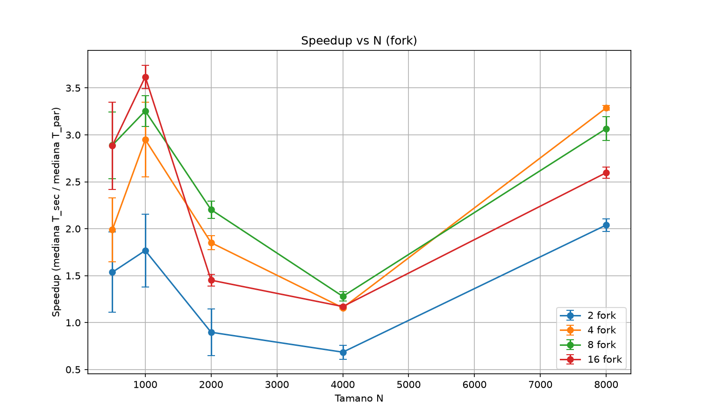
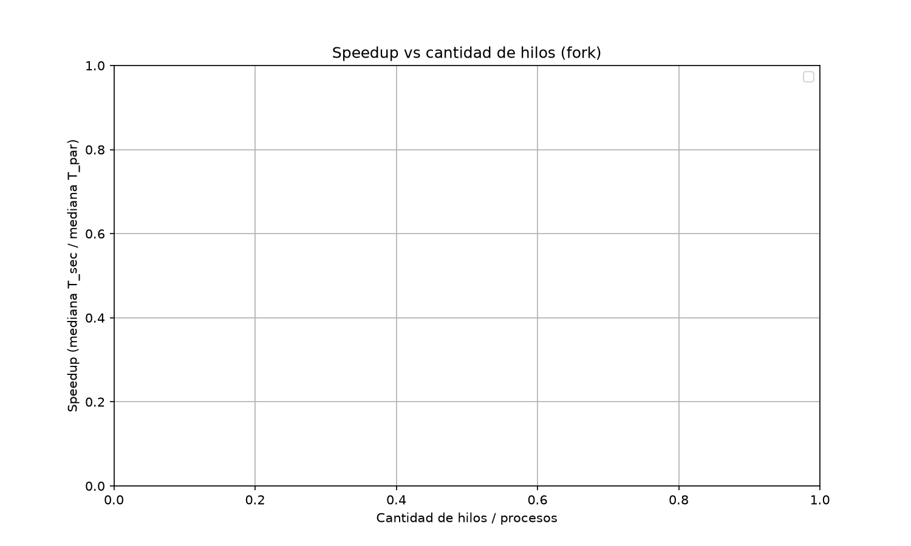
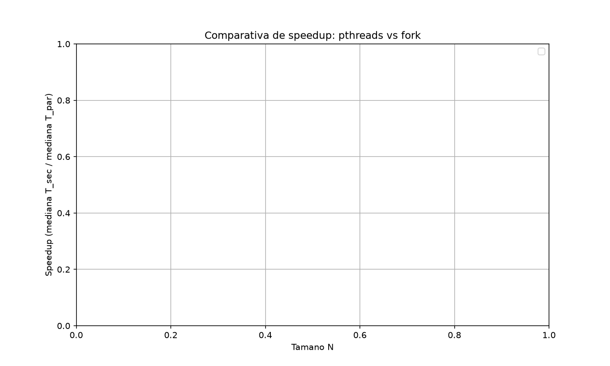

# Cuarta entrega: paralelización con procesos (fork)

> Esta entrega continúa el trabajo de la **tercera entrega** (rama `pthreads`), donde se paralelizó la multiplicación de matrices con **POSIX Threads**. Ahora se implementa la versión con **procesos** usando `fork()` y **memoria compartida POSIX**, y se comparan ambas técnicas con el mismo experimento.

## Resumen

Se agregó una tercera versión del programa: `matriz_fork`, que usa `fork()` de POSIX para crear procesos y **memoria compartida POSIX (POSIX shm)** para que los procesos vean las mismas matrices. Se repitió el mismo experimento de la tercera entrega (N=500 a 8000, 10 corridas por configuración) y se compararon los speedup de pthreads vs fork.

Hallazgos principales:

- En **N chicos (500, 1000)**, fork da mejor speedup que pthreads (porque el overhead de fork pesa menos proporcionalmente).
- En **N grandes (4000, 8000)**, pthreads es claramente mejor (hasta ~2× más rápido que fork).
- El crossover está en **N=2000**: pthreads empieza a ganar a partir de T=16, y definitivamente en N≥4000.

---

## 1. Conceptos clave

### 1.1 Wall clock vs tiempo de CPU

El comando Unix `time programa` desglosa el tiempo consumido en:

- **Wall clock** (tiempo total transcurrido): tiempo real desde que arranca hasta que termina. Es lo que el usuario percibe como "cuánto tardó".
- **Tiempo de CPU**: lo que la CPU pasó realmente ejecutando nuestro programa. Se subdivide en tiempo de usuario y tiempo de sistema.

El profesor dijo que **la métrica correcta para medir rendimiento es el wall clock**, porque refleja lo que el usuario percibe.

Usamos `clock_gettime(CLOCK_MONOTONIC_RAW)` para medir wall clock.

**Importante**: solo se mide el tiempo de la multiplicación, no se cuenta el tiempo de reservar memoria, generar matrices aleatorias, ni imprimir resultados.

### 1.2 Speedup

El speedup mide cuántas veces más rápida es la versión paralela respecto a la secuencial:

```
S = T_secuencial / T_paralelo
```

El speedup ideal con `T` procesos sería `T` (lineal). En la práctica es menor por el *overhead* de crear procesos, contención de memoria, etc.

### 1.3 Diez corridas por configuración

El profesor insistió en repetir el experimento varias veces porque una sola medición puede estar contaminada por ruido del sistema operativo (quantum preemptions, otros procesos usando CPU).

Con 10 corridas calculamos:

- **Media aritmética**: promedio de las 10 mediciones.
- **Mediana**: el valor central al ordenar las 10 mediciones. Es **robusta a valores atípicos**.
- **Desviación estándar (σ)**: qué tanto se dispersan las mediciones.

Usamos la **mediana** como medida principal del speedup para que un outlier no distorsione el resultado.

### 1.4 Orden de los bucles

El script recorre `for run_id in {1..10}: for n in tamanos: ...`. Es decir, para cada repetición pasa por **todos los tamaños** antes de la siguiente repetición.

Esto evita el envenenamiento de caché que ocurriría si las 10 repeticiones de N=500 se hicieran seguidas (los datos quedarían en L1/L2 y la medición saldría artificialmente rápida).

### 1.5 Quantum y estado de los procesos (lo que dijo el profesor)

Un proceso **no se ejecuta hasta terminar de corrido**. El sistema operativo le asigna un **quantum** (~10 ms). Cuando se acaba:

- Vuelve a la cola de "listos" si no ha terminado.
- Pasa a "bloqueado" si está esperando una operación de E/S.

El profesor explicó que **el quantum es por proceso, no por hilo**. Si un proceso tiene 100 hilos, ese quantum se reparte entre los 100. Por eso no conviene crear hilos "a lo loco".

### 1.6 Hilos vs Procesos

| Hilos | Procesos |
|---|---|
| Memoria compartida **implícita** | Memoria compartida **explícita** (hay que pedirla con `shm_open`) |
| Crear hilo es barato | Crear proceso es más caro (copia tablas, asigna PID) |
| Mismo espacio de direcciones | Cada uno con el suyo |
| `pthread_create` / `pthread_join` | `fork()` / `waitpid()` |

No hay una técnica universalmente mejor: depende del algoritmo, la arquitectura y los recursos disponibles. Esta entrega compara las dos con el mismo experimento.

---

## 2. El código

### 2.1 Estrategia de partición

La versión fork reutiliza el mismo bucle triple anidado de las versiones anteriores y reparte las **filas de la matriz resultado C** entre los T procesos:

```c
for (int i = 0; i < N; i++)
  for (int j = 0; j < N; j++)
    for (int k = 0; k < N; k++)
      C[i*N + j] += A[i*N + k] * B[k*N + j];
```

Cada proceso recibe N/T filas (con extras para los primeros si N no es divisible por T).

### 2.2 Por qué no hace falta sincronización

Cada proceso escribe **exclusivamente en su propio rango de filas de C**, así que no hay condición de carrera. Los procesos leen A y B simultáneamente (lectura sin escritura es segura).

La sincronización entre padre e hijos es `waitpid()` al final, para que el padre espere a que cada hijo termine antes de continuar.

### 2.3 Memoria compartida POSIX (POSIX shm)

En la versión con procesos, las matrices A, B y C no se pueden pasar por argumentos porque cada proceso tiene su propio espacio de direcciones. La solución es **memoria compartida POSIX**: una región de memoria que dos o más procesos pueden mapear en sus espacios de direcciones y ver los mismos bytes.

Las funciones que usamos son:

- **`shm_open(nombre, ...)`** — crea o abre una región con un nombre (similar a un archivo en `/dev/shm`).
- **`ftruncate(fd, tamaño)`** — fija el tamaño de la región.
- **`mmap(NULL, tamaño, PROT_READ|PROT_WRITE, MAP_SHARED, fd, 0)`** — mapea la región en la memoria del proceso. Con `MAP_SHARED`, las escrituras son visibles para todos los procesos que mapearon la misma región.
- **`shm_unlink(nombre)`** — elimina la región cuando ya no se necesita.

Cada matriz (A, B, C) tiene su propia región de memoria compartida, con un nombre distinto (`/matriz_fork_A`, `/matriz_fork_B`, `/matriz_fork_C`).

---

## 3. Estructura del proyecto

```
mult_matriz/
├── Makefile
├── README.md
├── .gitignore
├── src/                # archivos .c con los main() de cada versión
│   ├── matriz_monotonic.c   # versión secuencial
│   ├── matriz_pthreads.c    # versión paralela con pthreads (tercera entrega)
│   └── matriz_fork.c        # versión paralela con fork + shm
├── include/            # cabeceras (.h) de los módulos
│   ├── memoria.h       # reserva de memoria
│   ├── llenado.h       # llenado aleatorio
│   ├── tiempo_mult.h   # multiplicación secuencial + tiempo
│   ├── pthread_mult.h  # multiplicación paralela (pthreads) + tiempo
│   └── matrix_shm.h    # helpers para memoria compartida POSIX
├── modules/            # implementaciones (.c) de los módulos
│   ├── memoria.c
│   ├── llenado.c
│   ├── tiempo_mult.c
│   ├── pthread_mult.c
│   └── matrix_shm.c
└── experiments/        # automatización del experimento
    ├── run.sh
    ├── aggregate.py
    ├── plot.py
    ├── resultados_raw.csv          # pthreads (de la tercera entrega)
    ├── resultados.csv              # pthreads: agregado
    ├── resultados_fork_raw.csv     # fork: 1 fila por medición
    ├── resultados_fork.csv         # fork: agregado
    ├── speedup_vs_N.png            # pthreads
    ├── speedup_vs_T.png            # pthreads
    ├── speedup_vs_N_fork.png       # fork
    ├── speedup_vs_T_fork.png       # fork
    ├── speedup_comparativa.png     # pthreads vs fork en una sola gráfica
    └── speedup.png                 # copia de speedup_vs_N
```

---

## 4. Compilación y ejecución

| Comando | Qué hace |
|---|---|
| `make` o `make all` | Compila las tres versiones. |
| `make run <N> <valor_maximo>` | Ejecuta la versión **secuencial**. |
| `make run_par <N> <valor_maximo> <num_hilos>` | Ejecuta la versión **pthreads** (tercera entrega). |
| `make run_fork <N> <valor_maximo> <num_procesos>` | Ejecuta la versión **fork** (cuarta entrega). |
| `make clean` | Borra los binarios generados. |

Ejemplo:

```bash
make clean
make run_fork 500 10 4
```

`run_fork` enlaza con `-lrt` (biblioteca de tiempo real, necesaria para `shm_open`).

---

## 5. El experimento

### 5.1 Hardware

- CPU: Intel Core i5-12450HX
- 12 núcleos lógicos (8 físicos con hyperthreading)
- Sistema operativo: Linux
- Compilador: `gcc -O2`

### 5.2 Variables

- **Tamaño de la matriz N**: 500, 1000, 2000, 4000, 8000
- **Número de procesos T**: 2, 4, 8, 16 (sin T=1, ya medido en la versión secuencial)
- **Medición**: tiempo de la multiplicación en segundos (wall clock)

Total: **200 mediciones** (5 N × 4 T × 10 corridas).

### 5.3 Cómo se ejecutó

El script `experiments/run.sh` automatiza todo. Lanza ambos bloques:

```bash
nohup bash experiments/run.sh > experiments/run.log 2>&1 &
```

El bloque fork hereda las mediciones pthreads ya hechas (de la rama anterior), así que el script salta pthreads y solo ejecuta las 200 mediciones fork. Cada medición se guarda al CSV inmediatamente; si se interrumpe, los datos previos quedan y se continúa donde quedó.

---

## 6. Resultados

El experimento fork corrió del `mié 30 sep 2026 00:28:46` al `mié 30 sep 2026 11:44:01` (~11 horas).

### 6.1 Tiempos medidos con fork (segundos, mediana de 10 corridas)

| N    | T=2     | T=4     | T=8     | T=16    |
| ---: | ------: | ------: | ------: | ------: |
| 500   | 0.029   | 0.022   | 0.015   | 0.015   |
| 1000  | 0.239   | 0.143   | 0.130   | 0.117   |
| 2000  | 4.86    | 2.36    | 1.98    | 3.01    |
| 4000  | 110.5   | 65.3    | 59.1    | 64.6    |
| 8000  | 1197.2  | 742.7   | 796.2   | 940.1   |

### 6.2 Speedup fork (calculado sobre la mediana, vs secuencial)

| N    | T=2  | T=4  | T=8  | T=16 |
| ---: | ---: | ---: | ---: | ---: |
| 500   | 1.54 | 1.99 | 2.89 | 2.88 |
| 1000  | 1.77 | 2.95 | 3.25 | 3.62 |
| 2000  | 0.90 | 1.85 | 2.20 | 1.45 |
| 4000  | 0.69 | 1.16 | 1.28 | 1.17 |
| 8000  | 2.04 | 3.29 | 3.07 | 2.60 |

### 6.3 Comparativa pthreads vs fork

Misma tabla `(N, T)` para los dos métodos. La columna **Mejor** indica qué técnica dio mayor speedup para esa combinación.

| N    | T   | pthreads | fork   | Mejor |
| ---: | --: | -------: | -----: | :--- |
| 500   | 2  | 0.44× | 1.54× | **fork** |
| 500   | 4  | 0.83× | 1.99× | **fork** |
| 500   | 8  | 1.27× | 2.89× | **fork** |
| 500   | 16 | 1.40× | 2.88× | **fork** |
| 1000  | 2  | 0.56× | 1.77× | **fork** |
| 1000  | 4  | 1.06× | 2.95× | **fork** |
| 1000  | 8  | 1.59× | 3.25× | **fork** |
| 1000  | 16 | 2.07× | 3.62× | **fork** |
| 2000  | 2  | 0.61× | 0.90× | **fork** |
| 2000  | 4  | 1.16× | 1.85× | **fork** |
| 2000  | 8  | 1.83× | 2.20× | **fork** |
| 2000  | 16 | 2.66× | 1.45× | pthreads |
| 4000  | 2  | 1.11× | 0.69× | pthreads |
| 4000  | 4  | 1.88× | 1.16× | pthreads |
| 4000  | 8  | 2.55× | 1.28× | pthreads |
| 4000  | 16 | 3.11× | 1.17× | pthreads |
| 8000  | 2  | 3.53× | 2.04× | pthreads |
| 8000  | 4  | 5.86× | 3.29× | pthreads |
| 8000  | 8  | 6.90× | 3.07× | pthreads |
| 8000  | 16 | 6.08× | 2.60× | pthreads |

### 6.4 Outliers detectados

Al revisar las 10 corridas individuales de cada configuración, se identificaron outliers puntuales en fork (todos correspondientes a `run=10` en configuraciones con T=2):

| Configuración | Valor outlier | Tiempo (s) | Desviación |
| --- | ---: | ---: | --- |
| N=500, T=2, run=10 | 0.0565 | vs ~0.029 de los otros | casi 2× la mediana |
| N=1000, T=2, run=10 | 0.4257 | vs ~0.244 de los otros | 80% sobre la mediana |
| N=2000, T=2, run=10 | 9.8418 | vs ~4.86 de los otros | **el doble de la mediana** |
| N=4000, T=2, run=10 | 151.57 | vs ~110.5 de los otros | 37% sobre la mediana |
| N=8000, T=2, run=10 | 1327.32 | vs ~1197 de los otros | 11% sobre la mediana |

Es llamativo que **todos** corresponden a la corrida 10 de las configuraciones con T=2. Esto sugiere ruido del sistema (otra carga puntual) en una ventana específica de tiempo, no un problema del programa. El uso de la **mediana** como estimador central del speedup mitiga estos outliers, mientras que la media se vería fuertemente afectada.

### 6.5 Gráficas

**Speedup vs N (solo fork):**



**Speedup vs T (solo fork):**



**Comparativa pthreads vs fork (la gráfica principal de esta entrega):**



Las versiones de pthreads están en la rama anterior (`pthreads`) y se mantienen aquí para referencia.

---

## 7. Conclusiones

1. **Fork gana en N chicos (500, 1000)** consistentemente. Por ejemplo, con N=1000 y 16 procesos fork logra 3.62× vs 2.07× de pthreads. La explicación: en problemas chicos el tiempo de cómputo es muy pequeño y el overhead de fork (que se paga una sola vez por medición) pesa menos proporcionalmente. Pero la atención es de **medición**, no algorítmica: el **secuencial** que usamos como base es la versión secuencial con la misma instrumentación, y lo que comparamos es cuánto tarda cada técnica paralela contra ese mismo secuencial.

2. **Pthreads gana en N grandes (4000, 8000)** con diferencia de hasta ~2× (6.90× vs 3.07× en N=8000 T=8). La razón: en problemas grandes el cómputo domina y el overhead pesa menos. Ahí se ve el costo real de las dos estrategias:
   - **pthreads**: comparten memoria implícitamente, sin pasar por el kernel para sincronizar.
   - **fork**: cada proceso tiene su imagen propia; para compartir matrices hay que pasar por `shm_open`/`mmap`/`shm_unlink`. Cuando N es grande y los datos dominan, ese overhead extra se nota.

3. **El crossover está en N=2000**: en este tamaño pthreads empieza a ganar a partir de T=16, y definitivamente en N=4000+. Es la frontera práctica donde conviene cambiar de técnica.

4. **Outliers detectados pero no críticos**: las mediciones `run=10` en T=2 tuvieron valores anómalos en todas las configuraciones (el doble de la mediana en el peor caso, N=2000). Probable causa: ruido del sistema en una ventana específica de tiempo. La elección de la **mediana** como estimador central del speedup absorbe este efecto.

5. **No hay una técnica universalmente mejor**: la elección entre pthreads y fork depende del tamaño del problema y de la arquitectura. Para esta máquina con 12 núcleos lógicos, pthreads con 8 hilos en N=8000 da el mejor resultado global (6.90×).

6. **Limitación del experimento**: el speedup de fork se calcula contra el T=1 de **pthreads** (porque es el único secuencial medido). En teoría fork T=1 sería esencialmente igual, pero no se midió para ahorrar tiempo.